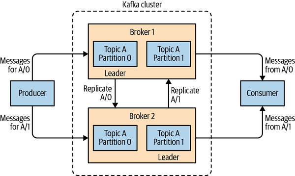

# Cours Kafka

- [Tutoriel Kafka](#kafka-tutorial)

  - [Pour Commencer](#getting-started)

  - [Concepts](#concepts)
  
    - [Messages](#messages)
    - [Schémas](#schemas)
    - [Sujets](#topics)
    - [Producteur](#producer)
    - [Consommateur](#consumer)
  
      - [Groupes de Consommateurs](#consumer-groups)
      - [Comportement du Consommateur](#consumer-behavior)
      - [Engagements et Décalages](#commits-and-offsets)
  
    - [Brokers (serveurs)](#brokers)
  
  - [Opérations](#operations)
  
    - [Garanties](#guarantees)
  
    - [Facteur de Réplication](#replication-factor)
  
      - [Disponibilité](#availability)
      - [Débit](#throughput)
      - [Latence](#latency)
  
    - [Durabilité](#durability)

    - [Sémantique de Livraison](#delivery-semantics)
  
      - [Producteur Idempotent](#idempotent-producer)
      - [Transactions](#transactions)
  
    - [Gestion des Erreurs](#error-handling)
  
      - [Arrêt en Cas d'Erreur](#stop-on-error)
      - [File d'Attente de Messages Non Remis](#dead-letter-queue)
      - [Sujets de Réessai](#retry-topics)
      - [Réessais Préservant l'Ordre](#order-preserving-retries)
  
  - [Références](#references)

***Apache Kafka*** a été développé comme un système de messagerie publish/subscribe conçu pour résoudre ce problème. Il est souvent décrit comme un « journal de commit distribué » ou plus récemment comme une « plateforme de streaming distribué ». Un journal de commit de système de fichiers ou de base de données est conçu pour fournir un enregistrement durable de toutes les transactions afin qu'elles puissent être rejouées pour reconstruire de manière cohérente l'état d'un système. De même, les données dans ***Kafka*** sont stockées de manière durable, en ordre, et peuvent être lues de manière déterministe. De plus, les données peuvent être distribuées au sein du système pour fournir des protections supplémentaires contre les pannes, ainsi que des opportunités significatives pour augmenter les performances.

## Pour commencer

### Choix (A) Lancer ***Kafka*** sans (GUI)

1. Lancer ***kafka*** depuis les binaries : 

- Clonez ***Kafka*** depuis le dépôt ***Github*** (déjà fait sur la machine virtuelle ***LINUX-LITE*** (Desktop)):

```bash
git clone https://github.com/apache/kafka.git kafka
```
- Lancer le serveur ***ZooKeeper***

```bash
bin/zookeeper-server-start.sh config/zookeeper.properties
```

- Lancer le serveur ***Kafka***

```bash 
bin/kafka-server-start.sh config/server.properties
```

2. Ou démarrez un cluster local :

```yaml
version: "3.3"

services:
  zookeeper:
    image: confluentinc/cp-zookeeper:latest
    environment:
      ZOOKEEPER_CLIENT_PORT: 2181
      ZOOKEEPER_TICK_TIME: 2000
    ports:
      - 2181:2181

  kafka:
    image: confluentinc/cp-kafka:latest
    depends_on:
      - zookeeper
    ports:
      - 29092:29092
      - 9092:9092
    environment:
      KAFKA_BROKER_ID: 1
      KAFKA_ZOOKEEPER_CONNECT: zookeeper:2181
      KAFKA_ADVERTISED_LISTENERS: PLAINTEXT://kafka:9092,PLAINTEXT_HOST://localhost:29092
      KAFKA_LISTENER_SECURITY_PROTOCOL_MAP: PLAINTEXT:PLAINTEXT,PLAINTEXT_HOST:PLAINTEXT
      KAFKA_INTER_BROKER_LISTENER_NAME: PLAINTEXT
      KAFKA_OFFSETS_TOPIC_REPLICATION_FACTOR: 1
```

```bash
docker compose up -d
```

### Choix (B) Lancer Kafka avec (GUI : Kafdrop)

1. Clonez le répertoire ***Kafdrop***

```bash
git clone https://github.com/obsidiandynamics/kafdrop.git && cd docker-compose/kafka-kafdrop && \
docker-compose up
```
2. L'interface est accessible sur le port ***9000*** : http://localhost:9000

### Une fois vous avez lancé Kafka, exportez les variables d'environnement

```bash
export BROKER=127.0.0.1
export TOPIC=test_lololo
export GROUP=$TOPIC
export BOOTSTRAP=127.0.0.1:9092
```

## Concepts

### Messages

L'unité de données dans ***Kafka*** est appelée un message. Un message peut avoir une pièce de métadonnée optionnelle, appelée une clé. Les messages et les clés sont tous deux traités comme des tableaux d'octets à l'intérieur de ***Kafka***.

Les clés sont utilisées lorsque les messages doivent être écrits dans des partitions de manière plus contrôlée. Le schéma le plus simple consiste à générer un hachage cohérent de la clé, puis à sélectionner le numéro de partition pour ce message en prenant le résultat du hachage modulo le nombre total de partitions dans le topic.

### Schemas (Schémas)

***Kafka*** prend en charge divers formats de sérialisation, y compris `JSON`, `XML` et `Avro`. En utilisant des schémas bien définis et en les stockant dans un dépôt commun, les messages dans ***Kafka*** peuvent être compris sans coordination.

### Topics (Sujets)

Les messages dans ***Kafka*** sont catégorisés en topics. Les analogies les plus proches pour un topic sont une table de base de données ou un dossier dans un système de fichiers. Les topics sont également divisés en plusieurs partitions. Les messages sont écrits dans une partition de manière `append-only` et sont lus dans l'ordre du début à la fin. Il est à noter qu'un topic a généralement plusieurs partitions, il n'y a donc aucune garantie de l'ordre des messages sur l'ensemble du topic, seulement au sein d'une seule partition.


```bash
# Create a new topic
./kafka-topics.sh --create --topic $TOPIC --partitions 1 --replication-factor 1 --bootstrap-server $BOOTSTRAP
```

```bash
# See all topics
./kafka-topics.sh --bootstrap-server $BOOTSTRAP --list
```

### Producer (Producteurs)

Les producteurs créent de nouveaux messages. Un message sera produit pour un ***topic spécifique (sujet)***. Par défaut, le producteur équilibrera les messages sur toutes les partitions d'un ***topic*** de manière égale. Dans certains cas, le producteur dirigera les messages vers des partitions spécifiques. Cela se fait généralement en utilisant ***la clé du message*** et un partitionneur qui générera ***un hachage de la clé et le mappera à une partition spécifique***. Cela garantit que tous les messages produits avec une clé donnée seront écrits dans la même partition. Le producteur peut également utiliser un partitionneur personnalisé qui suit d'autres règles métier pour mapper les messages aux partitions.


```py
#!/usr/bin/env python3
# -*- coding: utf-8 -*-

from kafka import KafkaProducer
import json
import time
import argparse
import uuid
import random

parser = argparse.ArgumentParser(description='Kafka producer test')
parser.add_argument('-topic', type=str, help='Name of the topic', required=True)
parser.add_argument('-kafka_host', type=str, help='Kafka host', required=True)
parser.add_argument('-kafka_port', type=str, help='Kafka port', required=True)

args = parser.parse_args()
if args.topic is None or args.kafka_host is None or args.kafka_port is None:
  parser.print_help()


print(args)


class KafkaSink:

  def __init__(self, host, port):
    self.producer = KafkaProducer(
      bootstrap_servers=f'{host}:{port}',
      value_serializer=lambda v: json.dumps(v).encode('utf-8'),
      compression_type='gzip')

  def ingest(self, topic, data):
    for datum in data:
      self.producer.send(topic, datum)
    self.producer.flush()


k = KafkaSink(args.kafka_host, args.kafka_port)

for x in range(20):
  data = {
    "msg_id": str(uuid.uuid4()),
    "msg_type": "test",
    "source": "test_script",
  }
  k.ingest(args.topic, [data])
```

```bash
python3 ./test.py -topic $TOPIC -kafka_host $BROKER -kafka_port 9092
```

```bash
# Describe a topic
./kafka-topics.sh --bootstrap-server $BOOTSTRAP --topic $TOPIC --describe

# See total messages in a topic
./kafka-run-class.sh kafka.tools.GetOffsetShell --broker-list $BOOTSTRAP --topic $TOPIC | awk -F  ":" '{sum += $3} END {print sum}'
```

### Consumer (Consommateurs)

Les consommateurs lisent les messages. Le consommateur s'abonne à un ou plusieurs topics et lit les messages dans l'ordre où ils ont été produits pour chaque partition. Le consommateur garde une trace des messages qu'il a déjà consommés en suivant l'`offset des messages`. L'offset, une valeur entière qui augmente continuellement, est une autre pièce de métadonnée que ***Kafka*** ajoute à chaque message lorsqu'il est produit. Chaque message dans une partition donnée a un offset unique, et le message suivant a un offset plus grand (bien que pas nécessairement monotoniquement plus grand). En stockant le prochain offset possible pour chaque partition, généralement dans ***Kafka*** lui-même, un consommateur peut s'arrêter et redémarrer sans perdre sa place.

```py
#!/usr/bin/env python3
# -*- coding: utf-8 -*-

from kafka import KafkaConsumer
import json
import time
import argparse
import uuid
import random

parser = argparse.ArgumentParser(description='Kafka consumer test')
parser.add_argument('-topic', type=str, help='Name of the topic', required=True)
parser.add_argument('-kafka_host', type=str, help='Kafka host', required=True)
parser.add_argument('-kafka_port', type=str, help='Kafka port', required=True)

args = parser.parse_args()
if args.topic is None or args.kafka_host is None or args.kafka_port is None:
  parser.print_help()

print(args)

class KafkaSource:

  def __init__(self, host, port):
    self.consumer = KafkaConsumer(
      args.topic,
      auto_offset_reset='latest',  # 'latest',
      bootstrap_servers=f'{host}:{port}')

  def ingest(self):
    for datum in self.source:
      print(f"Receiived {datum}, yay")


k = KafkaSource(args.kafka_host, args.kafka_port)
k.ingest()
```

#### Consumer Groups (Groupes de consommateurs)

Les consommateurs fonctionnent en tant que partie d'un groupe de consommateurs, qui est composé d'un ou plusieurs consommateurs travaillant ensemble pour consommer un topic. Le groupe garantit que chaque partition est consommée par un seul membre. De cette manière, les consommateurs peuvent évoluer horizontalement pour consommer des topics avec un grand nombre de messages. De plus, si un seul consommateur échoue, les membres restants du groupe réassigneront les partitions consommées pour prendre en charge le membre manquant.


```bash
# see group offsets
./kafka-consumer-groups.sh --bootstrap-server $BOOTSTRAP --group $GROUP --describe --offsets
```

#### Consumer behavior (Comportement du consommateur)

Les consommateurs dans un `groupe de consommateurs` partagent la propriété des partitions dans les topics auxquels ils s'abonnent. Lorsque nous ajoutons un nouveau consommateur au groupe, il commence à consommer des messages à partir de partitions précédemment consommées par un autre consommateur. La même chose se produit lorsqu'un consommateur s'arrête ou se bloque ; il quitte le groupe, et les partitions qu'il utilisait pour consommer seront consommées par l'un des consommateurs restants. La réaffectation des partitions aux consommateurs se produit également lorsque les topics consommés par le groupe de consommateurs sont modifiés.

Si le nombre de consommateurs dans un groupe est inférieur au nombre de partitions :


Si le nombre de consommateurs dans un groupe est égal au nombre de partitions :


Si le nombre de consommateurs dans un groupe est supérieur au nombre de partitions :


Chaque groupe de consommateurs peut consommer tous les messages :


Transférer la propriété d'une partition d'un consommateur à un autre est appelé un rééquilibrage. Les rééquilibrages sont importants car ils fournissent au groupe de consommateurs une haute disponibilité et une extensibilité (nous permettant d'ajouter et de supprimer facilement et en toute sécurité des consommateurs), mais dans le cours normal des événements, ils peuvent être assez indésirables.

#### Commits and Offsets (Commits et décalages)

Une des caractéristiques uniques de ***Kafka*** est qu'elle permet aux consommateurs d'utiliser ***Kafka*** pour suivre leur position (offset) dans chaque partition. Nous appelons l'action de mettre à jour la position actuelle dans la partition un ***commit d'offset***. Les consommateurs commettent le dernier message qu'ils ont traité avec succès à partir d'une partition et supposent implicitement que chaque message avant le dernier a également été traité avec succès.

Pour maintenir les offsets de commit, les consommateurs envoient un message à ***Kafka***, qui met à jour un topic spécial __consumer_offsets avec l'offset commit pour chaque partition. Si un consommateur tombe en panne ou qu'un nouveau consommateur rejoint le groupe de consommateurs, cela déclenchera un rééquilibrage. Après un rééquilibrage, chaque consommateur peut se voir attribuer un nouvel ensemble de partitions par rapport à celui qu'il traitait précédemment. Pour savoir où reprendre le travail, le consommateur lira le dernier offset de commit de chaque partition et continuera à partir de là.

```bash
# reset or shift offsets
./kafka-consumer-groups.sh --bootstrap-server $BOOTSTRAP --group $TOPIC --reset-offsets --to-latest
./kafka-consumer-groups.sh --bootstrap-server $BOOTSTRAP --group $TOPIC --topic $TOPIC --execute --reset-offsets --to-earliest
./kafka-consumer-groups.sh --bootstrap-server $BOOTSTRAP --group $TOPIC --topic $TOPIC --execute --reset-offsets --to-latest
./kafka-consumer-groups.sh --bootstrap-server $BOOTSTRAP --group $TOPIC --topic $TOPIC --execute --reset-offsets --shift-by 60
```

### Brokers (Serveurs)

Un serveur ***Kafka*** unique est appelé un serveur (broker). Le serveur reçoit des messages des producteurs, leur attribue des offsets, et écrit les messages sur le stockage sur disque. Il répond également aux requêtes de récupération (fetch requests) des consommateurs pour les partitions et renvoie les messages qui ont été publiés. Selon le matériel spécifique et ses caractéristiques de performance, un seul serveur peut facilement gérer des milliers de partitions et des millions de messages par seconde.

Les serveurs ***Kafka*** sont conçus pour fonctionner au sein d'un cluster. Au sein d'un cluster de serveurs, un serveur fonctionnera également en tant que contrôleur de cluster (élu automatiquement parmi les membres actifs du cluster). Le contrôleur est responsable des opérations administratives, notamment de l'attribution des partitions aux serveurs et de la surveillance des pannes de serveurs. Une partition est possédée par un seul serveur dans le cluster, et ce serveur est appelé le leader de la partition. Une partition répliquée est attribuée à des serveurs supplémentaires, appelés suiveurs (followers) de la partition. La réplication fournit une redondance des messages dans la partition, de sorte qu'un des suiveurs peut prendre le relais du leadership en cas de panne d'un serveur. Tous les producteurs doivent se connecter au leader pour publier des messages, mais les consommateurs peuvent récupérer des messages à partir du leader ou de l'un des suiveurs. Les opérations de cluster, y compris la réplication des partitions



## Operations (Opérations)

### Guarantees (Garanties)

1. ***Kafka*** garantit l'ordre des messages dans une partition.
2. Les messages produits sont considérés comme "commités" lorsqu'ils ont été écrits dans la partition sur toutes ses répliques synchronisées (mais pas nécessairement flushés sur le disque).
3. Les messages qui sont commités ne seront pas perdus tant qu'au moins une réplique reste active.
4. Les consommateurs ne peuvent lire que les messages qui sont commités.

### Replication Factor (Facteur de Réplication)

Un facteur de réplication de ***N*** nous permet de perdre ***N-1*** serveurs (brokers) tout en étant toujours capable de lire et d'écrire des données sur le topic. Ainsi, un facteur de réplication plus élevé conduit à une disponibilité plus élevée, une fiabilité accrue et moins de désastres. En revanche, pour un facteur de réplication de N, nous aurons besoin d'au moins ***N serveurs*** et nous stockerons N copies des données, ce qui signifie que nous aurons besoin d'autant d'espace disque. En somme, nous échangeons essentiellement la disponibilité contre le matériel.

#### Availability (Disponibilité)

Chaque réplique est une copie de toutes les données dans une partition. Si une partition a une seule réplique et que le disque devient inutilisable pour une raison quelconque, nous avons perdu toutes les données dans la partition.

#### Throughput (Débit)

Avec chaque réplique supplémentaire, nous multiplions le trafic inter-serveur.

#### Latency (Latence)

Chaque enregistrement produit doit être répliqué sur toutes les répliques synchronisées avant d'être disponible pour les consommateurs. Avec plus de répliques, il y a une plus grande probabilité qu'une de ces répliques soit un peu lente et ralentisse donc les consommateurs.

### Durability (Durabilité)

***Kafka*** accusera réception des messages qui n'ont pas été persistés sur le disque, en se basant uniquement sur le nombre de répliques ayant reçu le message. ***Kafka*** va flusher les messages sur le disque lors de la rotation des segments (par défaut de 1 Go de taille) et avant les redémarrages, mais sinon, il s'appuiera sur le cache de page Linux pour flusher les messages lorsqu'il devient plein.

### Delivery Semantics (Sémantique de Livraison)

***Kafka*** prend en charge la sémantique de livraison exacte une fois (exactly-once delivery semantics). La sémantique de livraison exacte dans ***Kafka*** est une combinaison de deux fonctionnalités clés : les producteurs idempotents, qui aident à éviter les doublons causés par les réessais des producteurs, et les sémantiques transactionnelles, qui garantissent un traitement exact une fois dans les applications de traitement en continu.

#### Idempotent Producer (Producteur Idempotent)

Lorsque les producteurs idempotents sont activés, chaque message inclura un identifiant unique du producteur (PID) et un numéro de séquence. Ceux-ci, avec le sujet et la partition cibles, identifient de manière unique chaque message. Les serveurs utilisent ces identifiants uniques pour suivre les cinq derniers messages produits pour chaque partition sur le serveur. Pour limiter le nombre de numéros de séquence précédents à suivre pour chaque partition, nous exigeons également que les producteurs utilisent max.inflight.requests=5 ou moins (la valeur par défaut est 5). Lorsqu'un serveur reçoit un message qu'il a déjà accepté auparavant, il rejette le doublon avec une erreur appropriée.

#### Transactions

Les transactions ***Kafka*** introduisent l'idée d'écritures atomiques multipartitions. L'idée est que la validation des décalages et la production de résultats impliquent toutes deux l'écriture de messages dans des partitions. Cependant, les résultats sont écrits dans un sujet de sortie, et les décalages sont écrits dans le sujet ***(Topic)*** ***_consumer_offsets***. Si nous pouvons ouvrir une transaction, écrire les deux messages, et valider si les deux ont été écrits avec succès — ou annuler pour réessayer s'ils ne l'ont pas été — nous obtenons une sémantique exactement une fois. Nous contrôlons la consommation des messages qui ont été écrits transactionnellement en définissant la configuration ***isolation.level***.


### Error Handling (Gestion des Erreurs)

#### Stop-on-error (Arrêt-sur-erreur)

Il existe des cas où tous les événements d'entrée doivent être traités dans l'ordre sans exceptions. Un exemple est la gestion du flux de capture de données de changement à partir d'une base de données.


#### Dead-letter queue (file de lettres mortes)

C'est un scénario courant où les événements qui ne peuvent pas être traités par l'application sont dirigés vers un sujet d'erreur tandis que le flux principal continue.


#### Retry Topics (Sujets de Réessai)

L'ajout d'un sujet de réessai offre la possibilité de traiter la plupart des événements immédiatement tout en retardant le traitement d'autres événements jusqu'à ce que les conditions requises soient satisfaites. Dans l'exemple, vous dirigeriez les événements vers le sujet de réessai si le prix de l'article n'est pas disponible pour le moment. Cette condition récupérable ne doit pas être traitée comme une erreur mais réessayée périodiquement jusqu'à ce que les conditions soient remplies.


#### Order-preserving retries (Réessais préservant l'ordre)

Dans ce modèle, l'application principale doit suivre chaque événement dirigé vers le sujet de réessai. Lorsqu'une condition dépendante n'est pas satisfaite (par exemple, le prix d'un article), l'application principale stocke un identifiant unique pour l'événement dans une structure locale en mémoire. Les identifiants d'événements uniques sont regroupés par l'élément auquel ils appartiennent. Cela aide l'application à déterminer si les événements liés à un élément particulier, par exemple, l'élément A, sont actuellement en cours de réessai et donc les événements ultérieurs liés à l'élément A doivent être envoyés vers le chemin de réessai pour préserver l'ordre.


## Références

Manuels :

1. [Kafka: The Definitive Guide](https://learning.oreilly.com/library/view/kafka-the-definitive/9781492043072/)
2. [Kafka in Action](https://learning.oreilly.com/library/view/kafka-in-action/9781617295232/)
3. [Error handling](https://www.confluent.io/blog/error-handling-patterns-in-kafka/)
4. [Confluent docs](https://docs.confluent.io/platform/current/kafka/kafka-basics.html)
5. [Official docs](https://kafka.apache.org/20/documentation.html)
6. [Source](https://github.com/apache/kafka)
